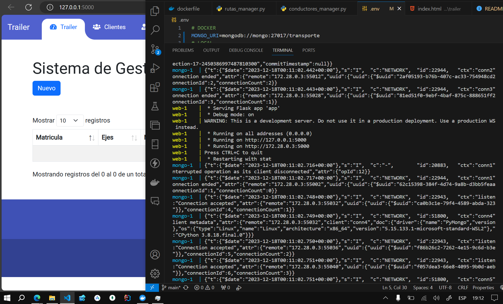
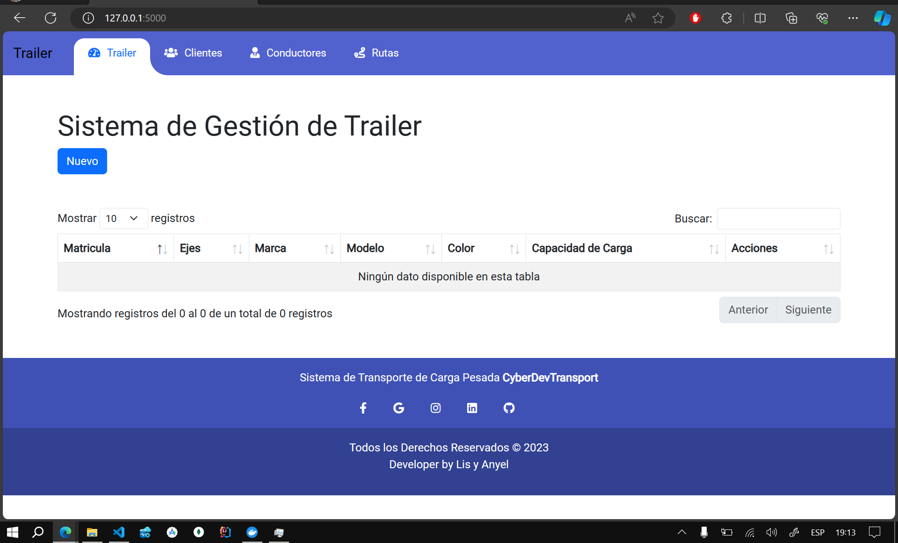
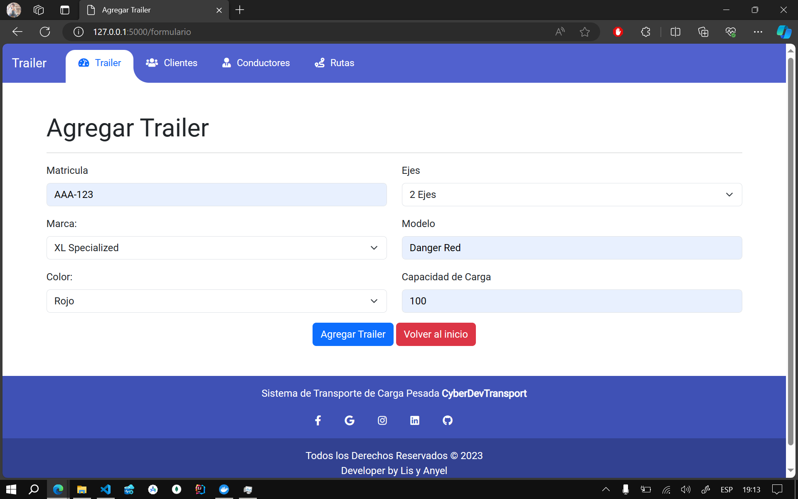
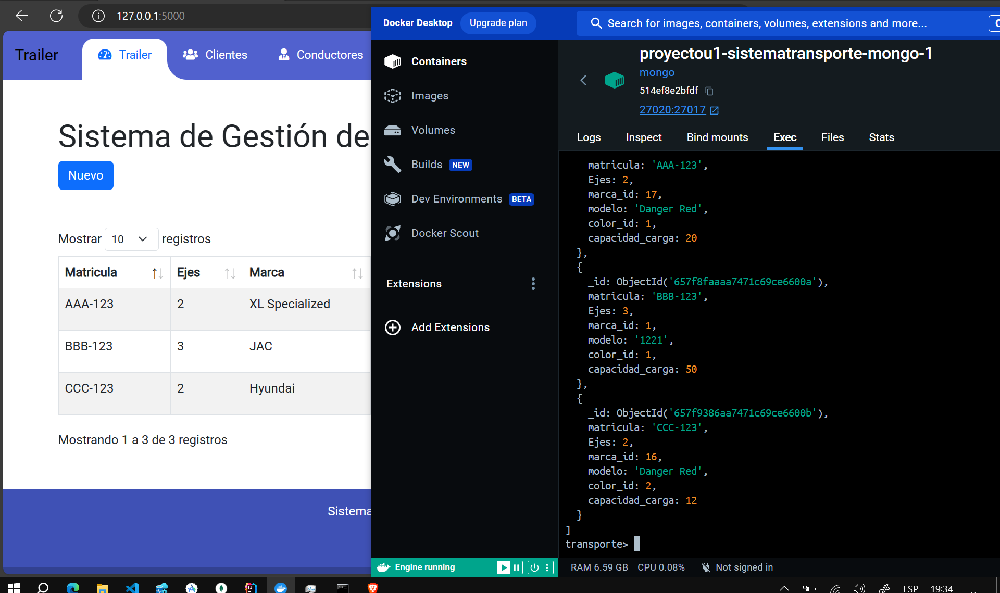
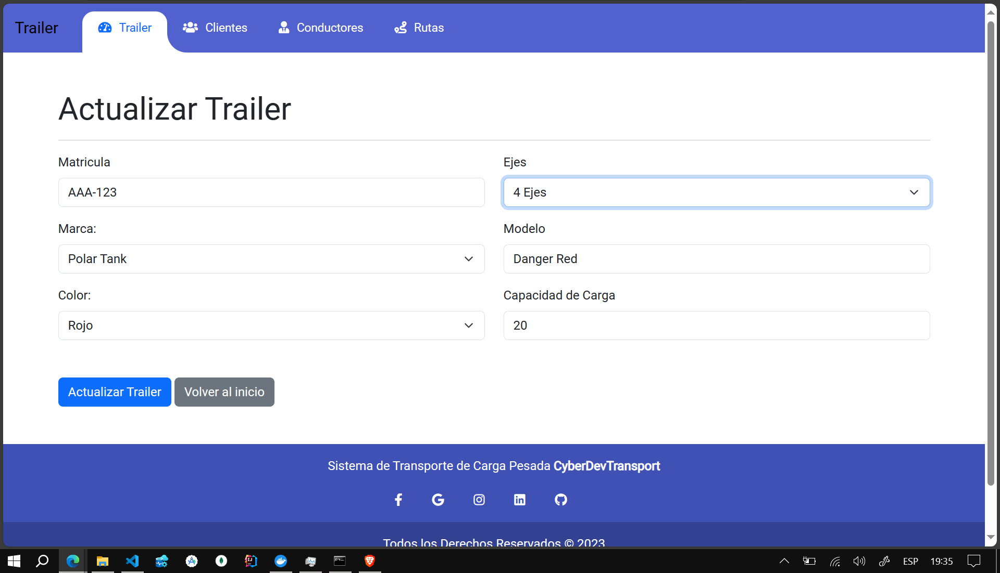
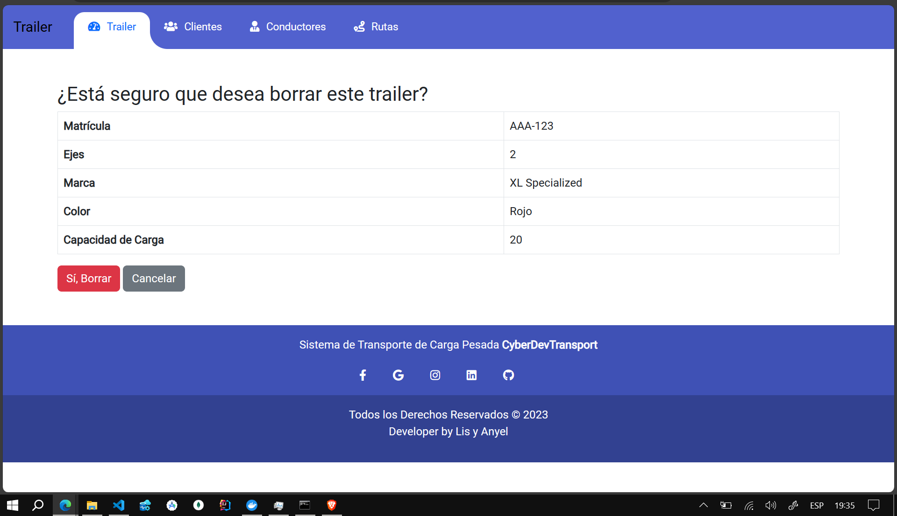
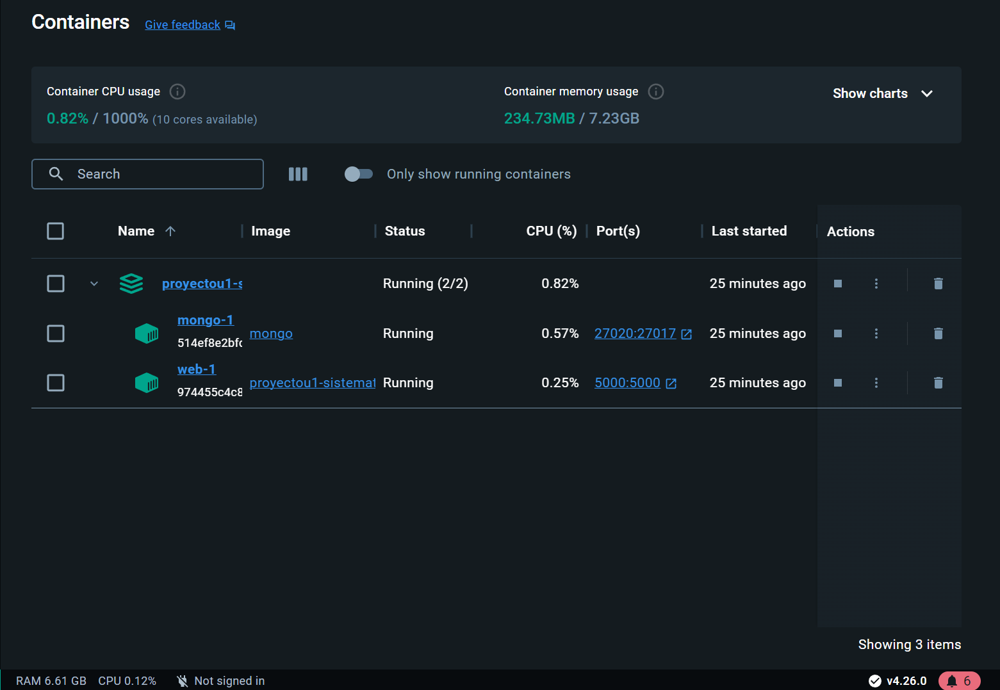

## Proyecto de Sistema de Transporte de Carga Pesada

Este proyecto implementa un sistema de transporte de carga pesada utilizando tecnologías como Docker, Flask y MongoDB. El sistema proporciona funcionalidades para gestionar trailers, clientes, conductores y rutas. A continuación, se presenta una breve guía para configurar y ejecutar el proyecto.

### Requisitos Previos
- Docker
- Docker Compose
- Python 3.8

### **Select Language:**
- [Español (Spanish)](README-es.md)
- [English](README.md)

## Resultado
### Levantamiento del Servicio Web (Flask) y MongoDB
 
### Inicio
 
### Agregar  

### Agregando 
 
### Lista de Datos en Web y MongoDB (Docker)
 
### Actualizar
 
### Eliminar
 
### Container
 

### Configuración del Entorno

1. Crea un archivo `.env` en la raíz del proyecto y configura las variables de entorno necesarias. Aquí tienes un ejemplo:

    ```env
    # DOCKER
    MONGO_URI=mongodb://mongo:27017/transporte
    # LOCAL
    # MONGO_URI=mongodb://localhost:27017/proyecto
    SECRET_KEY=clave_secreta_aqui
    ```

2. Asegúrate de tener el archivo `requirements.txt` con las dependencias necesarias para el proyecto.

### Configuración de Docker

El proyecto utiliza Docker para la gestión de contenedores. A continuación, se proporciona un ejemplo del archivo `docker-compose.yml`:

```yaml
version: '3'
services:
  web:
    build: .
    ports:
      - "5000:5000"
    depends_on:
      - mongo
    env_file:
      - .env
    
  mongo:
    image: mongo
    ports:
      - "27020:27017"
    volumes:
      - type: bind
        source: ./data
        target: /data/db
```

### Ejecución del Proyecto

1. Construye y ejecuta los contenedores con Docker Compose:

    ```bash
    docker-compose up --build
    ```

2. Accede a la aplicación en [http://localhost:5000](http://localhost:5000).

### Funcionalidades Principales

- **Trailer:**
  - Inicio: `/`
  - Formulario para agregar trailer: `/formulario`
  - Agregar trailer: `/agregar`
  - Editar trailer: `/editar/<trailer_id>`
  - Eliminar trailer: `/eliminar/<trailer_id>`

- **Cliente:**
  - Inicio: `/cliente/`
  - Formulario para agregar cliente: `/cliente/formulario`
  - Agregar cliente: `/cliente/agregar`
  - Editar cliente: `/cliente/editar/<cliente_id>`
  - Eliminar cliente: `/cliente/eliminar/<cliente_id>`

- **Conductor:**
  - Inicio: `/conductor/`
  - Formulario para agregar conductor: `/conductor/formulario`
  - Agregar conductor: `/conductor/agregar`
  - Editar conductor: `/conductor/editar/<conductor_id>`
  - Eliminar conductor: `/conductor/eliminar/<conductor_id>`

- **Rutas:**
  - Inicio: `/rutas/`
  - Formulario para agregar ruta: `/rutas/formulario`
  - Agregar ruta: `/rutas/agregar`
  - Editar ruta: `/rutas/editar/<ruta_id>`
  - Eliminar ruta: `/rutas/eliminar/<ruta_id>`

### Prueba de Conexión a MongoDB

- Puedes realizar una prueba de conexión a MongoDB accediendo a la ruta: `/test_mongo_connection`.
